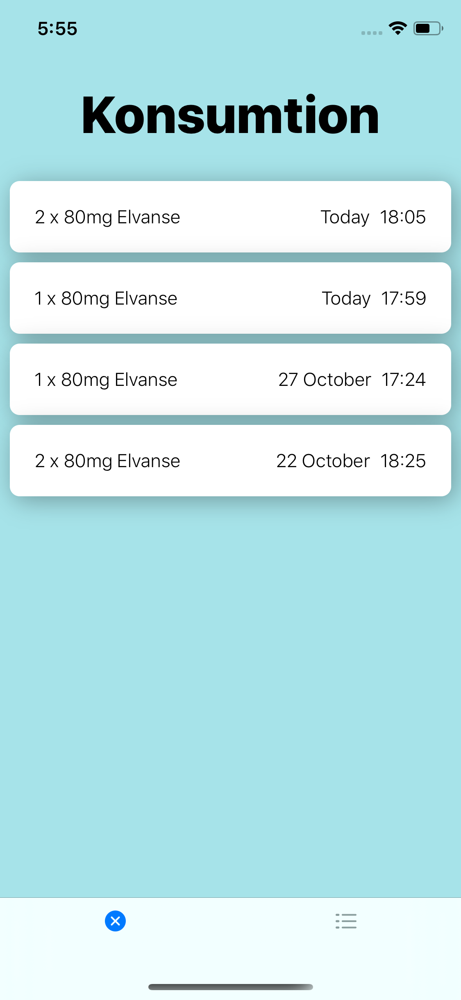
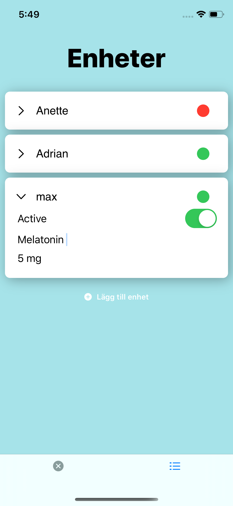

# espe-ios
The Espe Ios app

App for tracking medicine intake. The Iot device measure the weight of a tablett container and posts the data online.
The server does a little bit of math and returns intake time and number of tablett taken to the app.
Currently in development

  
  

